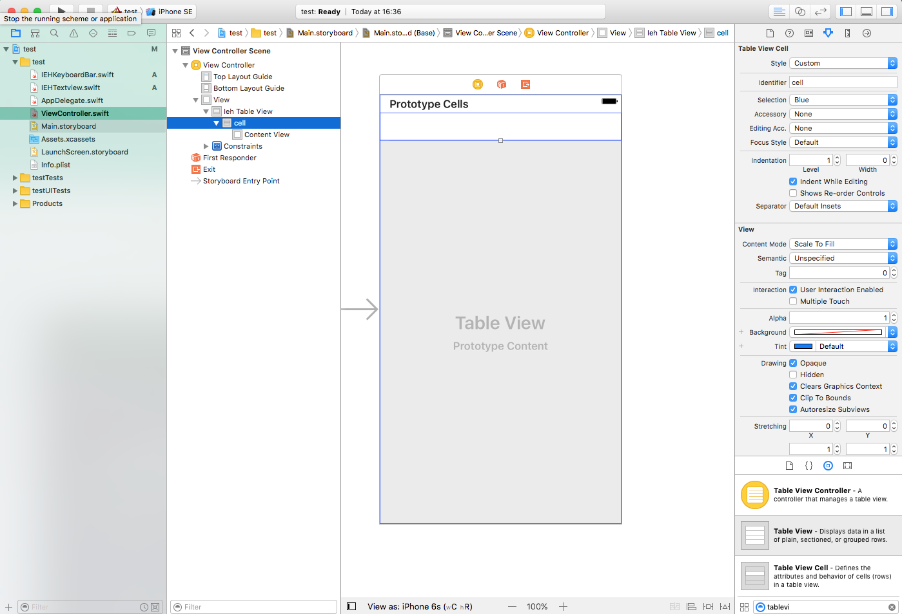

# ios10Keyboard
iOS keyboard for tableView or UIViews Storyboard implementation

## How to Use IEHKeyboard

### copy the 2 sources files into your project (Cocoapod coming soon)

### add a tableview into your view controller and set the class to IEHTableView

### add tableView as an outlet to your view controller

### create a prototype cell and give it an identifier

### check dismiss interactively(similar to imessage and whatsapp setting) or dismiss on drag 

Your good to go

